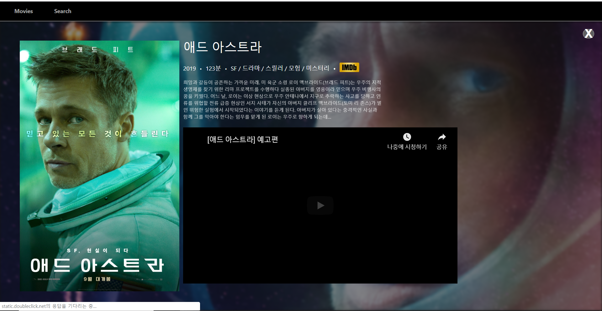

# 기능

- 한글 제목으로 검색 가능
- 영화 포스터에 마우스를 올리면 영화의 줄거리를 간단히 볼 수 있음

# 개발하면서 있었던 에러 사항들..

- axios 0.19.0 버전에 버그가있어 api병합 오류로 api를 불러오면 401에러가 떳다.

  - yarn add axios@0.18.0로 해결

- Router.js에서 component철자오류로 Header.js파일만 화면에 불러왔던걸 해결.

- 원래 전체적인 색상은 흰색이였으나 (헤더 포함) 영화 상세화면에서 헤더 색상 흰색과 겹쳐서 안이뻐서 검정색상으로 변경
  - Detail화면에서 Header 색상만 검정으로 바꿔보고자 props등 온갖 방법을 동원해봤지만 실패..(좀 더 매달려보면 해결할 수 있을거 같았지만 이거에만 매달리고 있을 수는 없기에..)

